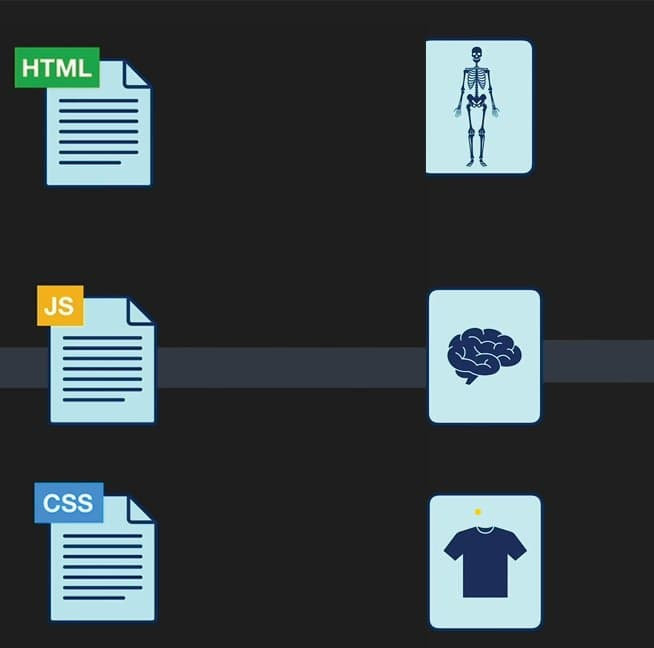

<div align="center">
  
  <p><strong>Roadmap to becoming a Front-End Developer in 2023.</strong></p>
</div>

---

<h1 align="center">:dart: Roadmap to boost your career</h1>

This is a curated roadmap to becoming a professional Front-end Developer that anyone could use to learn about the practice of front-end development.

---

<h3 align="center">Link icons:</h3>
<p align="center">📖 → Official Docs &nbsp; | &nbsp; 🎬 → Video &nbsp;</p>
<p align="center">📄 → Article &nbsp; | &nbsp; 🎬📃🎬 → Course</p>
<p align="center">
   → Personal Recommendation 
</p>
<p align="center">
   → YT Arabic Playlist; 
</p>
<p align="center">
   → English Playlist
</p>

<div align="center">
  <table>
    <thead align="center">
      <tr>
        <td colspan="3"><b>🗺️ Content</b></td>
      </tr>
    </thead>
    <tbody>
      <tr>
        <td>
          <a href="#introduction"><b>1-Introduction</b></a>
        </td>
        <td>
          <a href="#before-you-start"><b>2-Before you start</b></a>
        </td>
        <td>
          <a href="#front-end-development-techspec-overview"><b>3-Front-end Development Tech/Spec Overview &nbsp; </b></a>
        </td>
      </tr>
      <tr>
        <td>
          <a href="#required-for-any-path"><b>4-Required for any path</b></a>
        </td>
        <td>
          <a href="#basic-tools"><b>5-Basic tools</b></a>
        </td>
        <td>
          <a href="#level-one"><b>6-Level One (HTML, CSS, JS)</b> ✨</a>
        </td>
      </tr>
      <tr>
        <td>
          <a href="#level-two"><b>7-Level Two</b> ✨</a>
        </td>
        <td>
          <a href="#level-three"><b>8-Level Three</b> ✨</a>
        </td>
        <td>
          <a href="#what-next"><b>9-What Next?!</b></a>
        </td>
      </tr>
    </tbody>
  </table>
  
  <br />
  
  <div>
    
    <p>
      <strong>
        Any sources included in this roadmap are personal recommendations. You can choose one or more sources if you wish, or you can search for other sources.
      </strong>
    </p>
  </div>
</div>

---

# Introduction:

Front-end development involves using HTML, CSS, and JavaScript to build a client-side application. The client-side of an online application is the visual part of a web application and also what a user interacts with when an application is opened: colours, fonts, buttons, navigations, animations, etc.

[Introduction To Front End &nbsp; 🎬](https://youtu.be/6meCVoEo18o) &nbsp; 

Front-end development includes the user interface of an application. Everything a user interacts with when a user visits a website such as a login or sign-up page, homepage, contact page falls under the front-end development term.

A front-end developer is responsible for building and implementing the interface of a website or web application. They build client-side applications using web technologies such as HTML, CSS, and JavaScript.

In 2021 however, front-end development has gone beyond HTML, CSS, and JavaScript. There are a lot of web technologies you need to learn to be able to excel as a front-end developer this year.

> I will endeavor to cover all you need to get started with front-end development in 2023.

# Before you start:

First, you should read about [The Front-end Developer Profession &nbsp; 📄 ](https://frontendmasters.com/guides/learning-roadmap/front-end-developer-profession/)

## After this section, you should know:

- Front-end Developer Role
- Required Skills
- Job Titles

---

# Front-end Development Tech/Spec Overview

## In this section, you will learn about *Internet* and should know:

- The World Wide Web (aka WWW)
- Internet Fundamentals &  How it Works
- Hypertext Transfer Protocol (aka HTTP)
- Uniform Resource Locators (aka URL)
- Browsers and How The Web Works
- DNS, Domain Name and Hosting

<br />

## Here are some resources:

> skip what you already familiar with :handshake:

- [The Front-end Development Tech/Spec Overview &nbsp; 📄](https://frontendmasters.com/guides/learning-roadmap/front-end-development-overview/)
- [World Wide Web (WWW) Basic Mechanics &nbsp; 📄](https://frontendmasters.com/guides/learning-roadmap/www-basic-mechanics/)
- How does the Internet work?
  - [How does the Internet work? &nbsp; 📄](https://developer.mozilla.org/en-US/docs/Learn/Common_questions/How_does_the_Internet_work)
  - [The Internet Explained &nbsp; 📄](https://www.vox.com/2014/6/16/18076282/the-internet) 
  - [How the Internet Works in 5 Minutes &nbsp; 🎬 ](https://youtu.be/7_LPdttKXPc)
  - [How Does the Internet Work? &nbsp; 📄](https://web.stanford.edu/class/msande91si/www-spr04/readings/week1/InternetWhitepaper.htm)
  - [How The Web Works &nbsp; 📄](https://academind.com/tutorials/how-the-web-works)
- What is HTTP?
  - [What is HTTP? &nbsp; 📄](https://www.cloudflare.com/en-gb/learning/ddos/glossary/hypertext-transfer-protocol-http/)
  - [How HTTPS Works? &nbsp; 📄](https://howhttps.works/)
  - [An overview of HTTP &nbsp; 📄](https://developer.mozilla.org/en-US/docs/Web/HTTP/Overview)
  - [HTTP Messages - MDN 📄](https://developer.mozilla.org/en-US/docs/Web/HTTP/Messages)
  - [HTTP Crash Course & Exploration 🎬](https://youtu.be/iYM2zFP3Zn0)
  - [HTTP/3 From A To Z: Core Concepts](https://www.smashingmagazine.com/2021/08/http3-core-concepts-part1/)
  - [HTTP & Web Sockets &nbsp; 📄](https://frontendmasters.com/guides/learning-roadmap/http/)
- How Browsers Work?
  - [How Browsers Work &nbsp; 📄](https://web.dev/howbrowserswork/)
  - [What is a web browser? &nbsp; 📄](https://www.mozilla.org/en-US/firefox/browsers/what-is-a-browser/)
  - [How Do Web Browsers Work? &nbsp; 🎬](https://www.youtube.com/watch?v=WjDrMKZWCt0)
  - [Role of Rendering Engine in Browsers &nbsp; 📄](https://www.browserstack.com/guide/browser-rendering-engine)
  - [How Browsers Work &nbsp; 📄](https://www.freecodecamp.org/news/web-application-security-understanding-the-browser-5305ed2f1dac/)
- DNS and how it works?
  - [What is DNS? &nbsp; 📄](https://www.cloudflare.com/learning/dns/what-is-dns/)
  - [What is DNS? &nbsp; 📄](https://aws.amazon.com/route53/what-is-dns/)
  - [Mess with DNS - DNS Playground &nbsp; 🎮](https://messwithdns.net/)
  - [DNS and How does it work? &nbsp; 🎬](https://youtu.be/Wj0od2ag5sk)
  - [DNS Records for Newbies - How To Manage Website Records &nbsp; 🎬](https://youtu.be/YV5tkQYcvfg)
- Domain Name
  - [What is a domain name? &nbsp; 📄](https://www.cloudflare.com/learning/dns/glossary/what-is-a-domain-name/)
  - [What is a Domain Name? - MDN &nbsp; 📄](https://developer.mozilla.org/en-US/docs/Learn/Common_questions/Web_mechanics/What_is_a_domain_name)
  - [What is a Domain Name? - A Beginners Guide to How Domain Names Work! &nbsp; 🎬](https://youtu.be/Y4cRx19nhJk)

---

# Required for any path:

There are some tools required for any path such as Basic Terminal Usage (Command line), Git - Version Control & Github.

`Note:`

> **Learn these tools in parallel with the rest of the courses**.

## Basic Terminal Usage (Command line)

The terminal is an interface used to execute text commands, and it gives you access to the underlying operating system. Basic terminal usage is a skill all developers need regardless of their specialization. Command line is very important so I strongly recommend you study more on how to use it.

> If you are on windows like me, I recommend using [git bash](https://git-scm.com/downloads).

**Here are some resources to learn command line:**

- [Learn Command Line &nbsp; 🎬📃🎬 ](https://www.youtube.com/playlist?list=PLDoPjvoNmBAxzNO8ixW83Sf8FnLy_MkUT) 
- [Command Line Crash Course - Freecodecamp &nbsp; 🎬 ](https://youtu.be/yz7nYlnXLfE)
- [Command line crash course &nbsp; 📄 ](https://developer.mozilla.org/en-US/docs/Learn/Tools_and_testing/Understanding_client-side_tools/Command_line)

## Git - Version Control

Git is a version control system that enables developers to track changes in their project. Git also helps developers collaborate as a team. Git is needed among developers, to ensure that there are no code conflicts between developers.

## Github

GitHub is a code hosting platform for software development. GitHub lets teams work together on projects and it is also used for version control. It can be used among teams to collaborate on a project. For example, a team of developers wants to build a web application and everyone is given a task that has to be updated daily while working on the project, in this case, Github helps them build a centralized repository where each team member can make updates or manage the code file or repository.

<br />

**Here are some resources to learn Git & GitHub:**

- [Git Handbook - Github guides &nbsp; 📄 ](https://guides.github.com/introduction/git-handbook/)
- [Git Videos &nbsp; 🎬📃🎬 ](https://git-scm.com/videos)
- [Git Cheat Sheet repo 📄](https://github.com/FADL285/git-cheat-sheet)
- [Git book - Git &nbsp; 📄 ](https://git-scm.com/book/en/v2)
- [Github Guides &nbsp; 📄 ](https://guides.github.com/activities/hello-world/)
- [Version Control with Git - Udacity &nbsp; 🎬📃🎬 ](https://www.udacity.com/course/version-control-with-git--ud123)
- [Introduction to Git and GitHub from Google &nbsp; 🎬📃🎬 ](https://www.coursera.org/learn/introduction-git-github)
- [An introduction to Git - Freecodecamp &nbsp; 📄 ](https://www.freecodecamp.org/news/what-is-git-and-how-to-use-it-c341b049ae61/)
- [Git & GitHub Arabic Tutorial &nbsp; 🎬📃🎬](https://www.youtube.com/playlist?list=PLqPejUavRNTXejD5npdmFbe6NU6dTJLhW) 
- [Learn Git and GitHub &nbsp; 🎬📃🎬 ](https://www.youtube.com/playlist?list=PLDoPjvoNmBAw4eOj58MZPakHjaO3frVMF) 
- [learn Git in Arabic &nbsp; 🎬📃🎬](https://www.youtube.com/playlist?list=PLfDx4cQoUNOYVfQs_NFNyykcqkaJ_plmK) 
- [Git Tutorial for Beginners: Learn Git in 1 Hour - Code with Mosh &nbsp; 🎬 ](https://youtu.be/8JJ101D3knE)
- [Git and GitHub for Beginners - Crash Course - Freecodecamp &nbsp; 🎬 ](https://youtu.be/RGOj5yH7evk)

---

# Basic tools

<div align="center">
  <p>Basic tools to get start.</p>

  <table>
    <thead align="center">
      <tr>
        <td><b>Text Editor :writing_hand:</b></td>
        <td><b>Browser :globe_with_meridians:</b></td>
        <td><b>:man_technologist: Terminal</b></td>
      </tr>
    </thead>
    <tbody>
      <tr>
        <td><a href="https://code.visualstudio.com/" target="_blank"><b>VS Code :ballot_box_with_check:</b></a></td>
        <td><a href="https://www.google.com/chrome/" target="_blank"><b>Google Chrome :ballot_box_with_check:</b></a></td>
        <td><a href="https://git-scm.com/downloads" target="_blank"><b>Git Bash :ballot_box_with_check:</b></a></td>
      </tr>
      <tr>
        <td><a href="https://atom.io/" target="_blank"><b>Atom</b></a></td>
        <td><a href="https://www.microsoft.com/en-us/edge" target="_blank"><b>Microsoft Edge</b></a></td>
        <td><a href="https://cmder.net/" target="_blank"><b>Cmder</b></a></td>
      </tr>
      <tr>
        <td><a href="https://www.jetbrains.com/webstorm/" target="_blank"><b>WebStorm</b></a></td>
        <td><a href="https://www.mozilla.org/en-US/firefox/new/" target="_blank"><b>Mozilla Firefox</b></a></td>
        <td><a href="https://hyper.is/" target="_blank"><b>Hyper</b></a></td>
      </tr>
    </tbody>
  </table>

  [Code Editors resources 📄](https://frontendmasters.com/guides/learning-roadmap/code-editors/)

</div>

---

# Level One:

<div align="center">
  <table>
    <thead align="center">
      <tr>
        <td colspan="3"><b>🗺️ Content</b></td>
      </tr>
    </thead>
    <tbody>
      <tr>
        <td>
          <a href="#html"><b>1- HTML</b></a>
        </td>
        <td>
          <a href="#css"><b>2- CSS</b></a>
        </td>
        <td>
          <a href="#html--css---resources--practice"><b>3- HTML & CSS - (resources & practice)</b></a>
        </td>
      </tr>
      <tr>
        <td colspan="2">
          <a href="#javascript"><b>4- JavaScript</b></a>
        </td>
        <td>
          <a href="#accessibility"><b>5- Accessibility</b></a>
        </td>
      </tr>
    </tbody>
  </table>
</div>

<p align="center">
  
</p>

## HTML:

HTML stands for Hypertext Markup Language. It is the markup language for building web pages, it is also the building block of the web. HTML is easy to learn and comprehend. With just HTML, you can build a basic website.

**Here are some resources to learn HTML:**

- [Learning resources and tools for HTML - Front-End Masters 📄](https://frontendmasters.com/guides/learning-roadmap/html/) ✨💫
- [Learn HTML - Elzero Web School 📄](https://elzero.org/learn-html/) ✨💫
  - [Learn HTML In Arabic 2021 🎬📃🎬](https://www.youtube.com/playlist?list=PLDoPjvoNmBAw_t_XWUFbBX-c9MafPk9ji) 
  - [HTML Study Plan 📄](https://elzero.org/study/html-2021-study-plan/)
  - [HTML Assignments 📄](https://elzero.org/category/assignments/html-assignments/)
- [MDN - HTML 📄](https://developer.mozilla.org/en-US/docs/Learn/HTML)
- [Learn HTML - web.dev 📄](https://web.dev/learn/html/) `recommended`
- [Learn Forms - web.dev 📄](https://web.dev/learn/forms/) `recommended`
- [HTML Full Course - Freecodecamp 🎬](https://youtu.be/pQN-pnXPaVg)
- [HTML Crash Course For Absolute Beginners - Traversy Media 🎬](https://www.youtube.com/watch?v=UB1O30fR-EE)

> For writing maintainable and scalable HTML documents, check this repo [HTML Best Practices](https://github.com/hail2u/html-best-practices)

---

## CSS:

CSS stands for Cascading Style Sheets. It is the technology to learn after HTML. It is used for styling our HTML. For example, we can use CSS to space our content, colours, fonts, etc.

**Here are some resources to learn CSS:**

- [Learn CSS - Elzero Web School 📄](https://elzero.org/learn-css/) ✨💫
    - [Learn CSS In Arabic 2021 🎬📃🎬](https://www.youtube.com/playlist?list=PLDoPjvoNmBAzjsz06gkzlSrlev53MGIKe) 
    - [CSS Study Plan 📄](https://elzero.org/study/css-2021-study-plan/)
    - [CSS Assignments 📄](https://elzero.org/category/assignments/css-assignments/)
- [MDN - CSS 📄](https://developer.mozilla.org/en-US/docs/Learn/CSS)
- [Web.dev - Learn CSS 📄](https://web.dev/learn/css/) ```recommended```
- [Web.dev - Learn Responsive Design 📄](https://web.dev/learn/design/) ```recommended```

> 💡 Take a look at this repository - [Awesome-CSS-Learning](https://github.com/FADL285/Awesome-CSS-Learning) - A tiny list limited to the best CSS Learning Resources.

<br />

**The basics of CSS you need to learn are:**

- Basics, Box Model, Colors & Gridents, Units :arrow_right: [CSS Fundamentals 📄](https://frontendmasters.com/guides/learning-roadmap/css-fundamentals)
- Flow, Positioning, Floats, Flex box, Grids :arrow_right: [CSS Layout 📄](https://frontendmasters.com/guides/learning-roadmap/css-layout/)
- Responsive Design & Media Queries :arrow_right: [CSS Media Queries 📄](https://frontendmasters.com/guides/learning-roadmap/css-media-queries/)
- Animations :arrow_right: [CSS Transitions, Transforms & Animation 📄](https://frontendmasters.com/guides/learning-roadmap/css-transitions-transforms-animations/)
- Web Fonts, CSS Icons, Google Fonts :arrow_right: [CSS Fonts & Icons 📄](https://frontendmasters.com/guides/learning-roadmap/css-fonts-and-icons/)
- CSS Variables & CSS Practices :arrow_right: [CSS Practices 📄](https://frontendmasters.com/guides/learning-roadmap/css-practices/)

---

## HTML & CSS - (Resources & Practice)

In this section, I will recommend some paid courses and YouTubevideos that explain and build websites using HTML and CSS.
Plus some websites to practice what you've learned.

**Here are some Paid Courses for HTML & CSS:** 🎬📃🎬 :dollar::dollar: 

- [Build Responsive Real-World Websites with HTML and CSS](https://www.udemy.com/course/design-and-develop-a-killer-website-with-html5-and-css3/)
- [Modern HTML & CSS From The Beginning (Including Sass)](https://www.udemy.com/course/modern-html-css-from-the-beginning/) :arrow_right: `exclude sass from it now`
- [CSS - The Complete Guide 2021 (incl. Flexbox, Grid & Sass)](https://www.udemy.com/course/css-the-complete-guide-incl-flexbox-grid-sass/) :arrow_right: `exclude sass from it now`

<br />

**Here are some YouTubeVideos for building templates with HTML & CSS:** 

- [Practical HTML & CSS - Elzero Web School 📄](https://elzero.org/practical-html-css/)
    - [HTML And CSS Template 1 🎬📃🎬](https://www.youtube.com/playlist?list=PLDoPjvoNmBAzHSjcR-HnW9tnxyuye8KbF) 
    - [HTML And CSS Template 2 🎬📃🎬](https://www.youtube.com/playlist?list=PLDoPjvoNmBAy1l-2A21ng3gxEyocruT0t) 
    - [HTML And CSS Template 3 🎬📃🎬](https://www.youtube.com/playlist?list=PLDoPjvoNmBAxuCSp2_-9LurPqRVwketnc) 
- [Design Template Using ( HTML 5 - CSS 3 ) - Unique Coderz Academy 🎬📃🎬](https://www.youtube.com/playlist?list=PLtFbQRDJ11kFq3C3I7sKHjXbFru4rx8qs) 
- [Design Responsive Template Using ( HTML - CSS - Media Query ) - Unique Coderz Academy 🎬📃🎬](https://www.youtube.com/playlist?list=PLtFbQRDJ11kG7W2TmVs4gr9FqmZ0Ui551) 
- [Traversy Media](https://www.youtube.com/channel/UC29ju8bIPH5as8OGnQzwJyA)
    - [Build a Responsive Website | HTML, CSS Grid, Flexbox & More 🎬](https://youtu.be/p0bGHP-PXD4)
    - [Build a Modern Landing Page Website | HTML & CSS 🎬](https://youtu.be/X1dz0xRbSJc)
    - [Build An HTML5 Website With A Responsive Layout 🎬](https://youtu.be/Wm6CUkswsNw)
    - [Pluralsight Login Page Clone - HTML & CSS 🎬](https://youtu.be/wIx1O5Y5EB4)
- [How To Make Website Using HTML & CSS | Full Responsive - Easy Tutorials 🎬📃🎬](https://youtu.be/oYRda7UtuhA)

<br />

- [ Frontend Masters Web Development Bootcamp ](https://frontendmasters.com/bootcamp/) -> ```included JS```

<br />

**Some challenges for what you have learned, Try** 🦾🦾😃
- [Flexbox Defense Game](http://www.flexboxdefense.com/)
- [Frontend Mentor](https://www.frontendmentor.io/challenges?sort=difficulty|asc&difficulties=1,2&languages=HTML|CSS&types=free)
- [Codewell](https://www.codewell.cc/challenges)
- [CSS Battle](https://cssbattle.dev/)
- [100 Days CSS](https://100dayscss.com/)

<br />

> After Learning HTML & CSS read this :arrow_right: [HTML Interview Questions 📄](https://www.interviewbit.com/html-interview-questions/) & [CSS Interview Questions 📄](https://www.interviewbit.com/css-interview-questions/)

---

## JavaScript:

JavaScript is one of the most popular programming languages in the world. It is the language of the web. As a front-end developer, it is required you learn JavaScript. JavaScript enables us to create dynamic content. When you create your HTML structure and your style with your CSS, JavaScript makes the website dynamic and alive.

> 💡💡 Learning Javascript and practicing on it continues with you to the end of the path and will not end.

**On this level, we will learn the basics of JavaScript**
- [JavaScript Fundamentals](https://frontendmasters.com/guides/learning-roadmap/javascript-fundamentals/)
- [DOM Manipulation & BOM](https://frontendmasters.com/guides/learning-roadmap/dom-bom-cssom/)
- AJAX, Fetch API and JSON
- [ES6+ & Modular JS](https://frontendmasters.com/guides/learning-roadmap/javascript-modules-scripts/)
- [Web APIs](https://developer.mozilla.org/en-US/docs/Web/API)
- [Object-oriented Programming (OOP)](https://frontendmasters.com/guides/learning-roadmap/js-oop/)
- [Regular Expressions (Regex)](https://frontendmasters.com/guides/learning-roadmap/javascript-regular-expressions/) `general skill`
- JavaScript Algorithms and Data Structures | Design Patterns

<br />

**Here are some resources to learn JavaScript:**

- [MDN - JavaScript 📄](https://developer.mozilla.org/en-US/docs/Learn/JavaScript/)
- [Learn JavaScript - Elzero Web School 📄](https://elzero.org/learn-javascript/) ✨💫
  - [Learn JavaScript In Arabic 2021 🎬📃🎬](https://www.youtube.com/playlist?list=PLDoPjvoNmBAx3kiplQR_oeDqLDBUDYwVv) 
- [JavaScript Samurai كورس جافاسكربت من الصفر حتى الاحتراف 🎬📃🎬](https://www.youtube.com/playlist?list=PLL2zWZTDFZzgU2x6Kk6w0qx5piLgMODsm) 
- [JavaScript.INFO 📄](https://javascript.info/intro)
- [Eloquent JavaScript 📕](https://eloquentjavascript.net/)
- [Learn JavaScript - Freecodecamp 🎬](https://youtu.be/PkZNo7MFNFg)
- [Traversy Media](https://www.youtube.com/channel/UC29ju8bIPH5as8OGnQzwJyA)
    - [JavaScript Crash Course For Beginners 🎬](https://youtu.be/hdI2bqOjy3c)
    - DOM Crash Course [Part #1 🎬](https://youtu.be/0ik6X4DJKCc) - [Part #2 🎬](https://youtu.be/mPd2aJXCZ2g) - [Part #3 🎬](https://youtu.be/wK2cBMcDTss)     - [Part #4 (Final Project) 🎬](https://youtu.be/i37KVt_IcXw)
    - [Fetch API Introduction 🎬](https://youtu.be/Oive66jrwBs)
    - [JSON Crash Course 🎬](https://youtu.be/wI1CWzNtE-M)
    - [JavaScript OOP Crash Course (ES5 & ES6) 🎬](https://youtu.be/vDJpGenyHaA)
- [JavaScript Tutorial for Beginners - Clever programmers 🎬](https://youtu.be/Qqx_wzMmFeA)
- [JavaScript Tutorial for Beginners - Programming with Mosh 🎬](https://youtu.be/W6NZfCO5SIk)
- [30 Days of JavaScript repo 📄](https://github.com/Asabeneh/30-Days-Of-JavaScript)

> 💡 Take a look at this repository - [Awesome-JavaScript-Learning](https://github.com/FADL285/Awesome-JavaScript-Learning) - A tiny list limited to the best JavaScript Learning Resources.

<br />

**Here are some resources to learn Regular Expressions (Regex):**

- [Regular Expressions Demystified 🎬📃🎬](https://www.youtube.com/playlist?list=PL55RiY5tL51ryV3MhCbH8bLl7O_RZGUUE) 
- [Regular Expression tutorial - Arabic 🎬📃🎬](https://www.youtube.com/playlist?list=PLwCMLs3sjOY4aVMg7hgQGHyQBZnHgFjJk)  `The implementation is not in JavaScript but explains the concept of Regex in a nice way`
- [Regular Expressions (RegEx) Tutorial 🎬📃🎬](https://www.youtube.com/playlist?list=PL4cUxeGkcC9g6m_6Sld9Q4jzqdqHd2HiD) 
- [Regular expressions - MDN 📄](https://developer.mozilla.org/en-US/docs/Web/JavaScript/Guide/Regular_Expressions)

<br />

**Here are some YouTubeVideos for practice on JavaScript.:**

- [JavaScript Practice - Elzero Web School 📄](https://elzero.org/javascript-practice/)
- [HTML | CSS | JavaScript | Projects - Shadow Coding 🎬📃🎬](https://www.youtube.com/playlist?list=PLS-MrzRLZtmflgWiToSs6jNwYaFK7FnWM) 
- [Build 15 JavaScript Projects - Vanilla JavaScript Course - FreeCodeCamp 🎬](https://youtu.be/3PHXvlpOkf4)
- [Traversy Media](https://www.youtube.com/channel/UC29ju8bIPH5as8OGnQzwJyA)
    - [Build 5 Projects With HTML, CSS & JavaScript 🎬](https://youtu.be/JkeyKeK3V24)
    - [Build a Netflix Landing Page Clone with HTML, CSS & JS 🎬](https://youtu.be/P7t13SGytRk)
- [Learn JavaScript by Building 7 Games - Full Course - FreeCodeCamp 🎬](https://youtu.be/lhNdUVh3qCc)
- [Build A Weather App in HTML CSS & JavaScript | Weather App in JavaScript 🎬](https://youtu.be/c1r-NqYkFPc)
- [Build A Music App With Javascript Tutorial 🎬](https://youtu.be/2VJlzeEVL8A)

<br />

**Here are some Paid Courses for JavaScript:** 🎬📃🎬 :dollar::dollar: 

- [JavaScript - The Complete Guide 2021 (Beginner + Advanced) 🎬📃🎬](https://www.udemy.com/course/javascript-the-complete-guide-2020-beginner-advanced/) ✨💫
- [Modern JavaScript (Complete guide, from Novice to Ninja) 🎬📃🎬](https://www.udemy.com/course/modern-javascript-from-novice-to-ninja/)
- [Modern JavaScript From The Beginning  🎬📃🎬](https://www.udemy.com/course/modern-javascript-from-the-beginning/)
- [50 Projects In 50 Days - HTML, CSS & JavaScript  🎬📃🎬](https://www.udemy.com/course/50-projects-50-days/)

<br />

**Here are some resources to learn JavaScript Algorithms, Data Structures and Design Patterns:**

- [JavaScript Algorithms and Data Structures - freeCodeCamp 📄](https://www.freecodecamp.org/learn/javascript-algorithms-and-data-structures/)
- [JavaScript Algorithms and Data Structures Masterclass 🎬📃🎬  💵💵](https://www.udemy.com/course/js-algorithms-and-data-structures-masterclass/)
- [Master the Coding Interview: Data Structures + Algorithms 🎬📃🎬  💵💵](https://www.udemy.com/course/master-the-coding-interview-data-structures-algorithms/)
- [Data Structure : JavaScript (leetcode problem-solving) - Shadow Coding 🎬📃🎬](https://www.youtube.com/playlist?list=PLS-MrzRLZtmdIHJ-Osvv_sJO1Msc4VM_7) 
- [JavaScript Algorithms and Data Structures 🎬📃🎬](https://www.youtube.com/playlist?list=PLC3y8-rFHvwjPxNAKvZpdnsr41E0fCMMP) 
- [Learning JavaScript Design Patterns 📄](https://www.patterns.dev/posts/classic-design-patterns/)
- [JavaScript Design Patterns – Explained with Examples 📄](https://www.freecodecamp.org/news/javascript-design-patterns-explained/)
- [Design Patterns | javascript 🎬📃🎬](https://www.youtube.com/playlist?list=PLS-MrzRLZtmduTfp_bReagQKg7I-GVr-5) 

<br />

> After Learning JavaScript read this :arrow_right: [JavaScript Interview Questions 📄](https://github.com/FADL285/javascript-interview-questions) & [37 Essential JavaScript Interview Questions 📄](https://www.toptal.com/javascript/interview-questions)

---

## Accessibility:

Digital accessibility, commonly abbreviated a11y, is about designing and building websites and web apps that disabled people can interact with in a meaningful and equivalent way.

**Here are some resources to learn HTML:**

- [Learn Accessibility - Web.dev 📄](https://web.dev/learn/accessibility/) ✨💫
- [Learn Accessibility - MDN 📄](https://developer.mozilla.org/en-US/docs/Learn/Accessibility)
- [Web Accessibility - Udacity 🎬📃🎬](https://www.udacity.com/course/web-accessibility--ud891)
- [Web Accessibility: Getting Started - pluralsight 🎬📃🎬](https://www.pluralsight.com/courses/web-accessibility-getting-started)

---

# Level Two:

<div align="center">
  <table>
    <thead align="center">
      <tr>
        <td colspan="4"><b>🗺️ Content</b></td>
      </tr>
    </thead>
    <tbody>
      <tr>
        <td>
          <a href="#Web-Developer-Tools"><b>1- Web Developer Tools</b></a>
        </td>
        <td>
          <a href="#Package-Managers"><b>2- Package Managers</b></a>
        </td>
        <td>
          <a href="#CSS-Architecture"><b>3-CSS Architecture</b></a>
        </td>
      </tr>
      <tr>
        <td>
          <a href="#CSS-Preprocessors"><b>4-CSS Preprocessors</b></a>
        </td>
        <td>
          <a href="#CSS-Frameworks"><b>5- CSS Frameworks (CSS UI Toolkits)</b></a>
        </td>
        <td>
          <a href="#JavaScript-Libraries"><b>6-JavaScript Libraries</b></a>
        </td>
      </tr>
    </tbody>
  </table>
</div>

## Web Developer Tools:

**Learning Resources**:
- [Mastering Chrome Developer Tools v2  🎬📃🎬  💵💵](https://frontendmasters.com/courses/chrome-dev-tools-v2/)
- [Chrome DevTools Docs 📄](https://developer.chrome.com/docs/devtools/)
- [Google Chrome Developer Tools Crash Course 🎬](https://youtu.be/x4q86IjJFag)
- [21+ Browser Dev Tools & Tips You Need To Know 🎬](https://youtu.be/TcTSqhpm80Y)

---

## Package Managers:

a package manager is a piece of software that lets you manage the dependencies (external code written by you or someone else) that your project needs to work correctly.

**Learning Resources**:
- [NPM 📖](https://docs.npmjs.com/)
    - [NPM Crash Course 🎬](https://youtu.be/jHDhaSSKmB0)
    - [How To Use [ NPM ] NodeJs Package Manager 🎬](https://youtu.be/OCIRRyBbz_w) 

- [Yarn 📖](https://classic.yarnpkg.com/en/docs)
    - [Yarn Package Manager Crash Course 🎬](https://youtu.be/g9_6KmiBISk)
    - [Yarn crash course in Arabic 🎬](https://youtu.be/1Sjhc09Q7f8) 

---

## CSS Preprocessors:

CSS preprocessors are scripting languages that extend the default capabilities of CSS. They enable us to use logic in our CSS code, such as variables, nesting, inheritance, mixins, functions, and mathematical operations. CSS preprocessors make it easy to automate repetitive tasks, reduce the number of errors and code bloat, create reusable code snippets, and ensure backward compatibility.

**Sass** is a preprocessor scripting language that is interpreted or compiled into Cascading Style Sheets. SassScript is the scripting language itself. Sass consists of two syntaxes (sass/scss).

**Learning Resources**:
- [Sass Docs 📖](https://sass-lang.com/documentation)
- [Sass Fundamentals 🎬📃🎬  💵💵](https://frontendmasters.com/courses/sass/)
- [Learn Sass - Elzero Web School 📄](https://elzero.org/study/sass-2021-study-plan/) ✨💫
  - [Learn SASS In Arabic 2021 🎬📃🎬](https://www.youtube.com/playlist?list=PLDoPjvoNmBAzlpyFHOaB3b-eubmF0TAV2) 
- [Sass Tutorial for Beginners - CSS With Superpowers 🎬](https://youtu.be/_a5j7KoflTs)
- [Sass and BEM for beginners 🎬](https://youtu.be/jfMHA8SqUL4)
- [Create Web Design With Sass 🎬📃🎬](https://www.youtube.com/playlist?list=PLDoPjvoNmBAz9sluuyOWPifXvySgrGma8) 
- [SASS Tutorial (Build Your Own CSS Library) 🎬📃🎬](https://www.youtube.com/playlist?list=PL4cUxeGkcC9jxJX7vojNVK-o8ubDZEcNb) 

---

## CSS Architecture:

[BEM](http://getbem.com) methodology gives your CSS code a solid structure that remains simple, easy to understand and easy to modify

**Learning Resources**:
-  [BEM 📄](http://getbem.com/introduction/)
-  [BEM Cheat Sheet 📄](https://9elements.com/bem-cheat-sheet/)
-  [Organize your CSS code using BEM 🎬](https://youtu.be/QtX-fPHUSpM) 
-  [You Probably Need BEM CSS in Your Life (Tutorial) 🎬](https://youtu.be/er1JEDuPbZQ)

---

## CSS Frameworks:

**Utility Toolkits**
- [Tailwind CSS 📖](https://tailwindcss.com/)
  - [Official Screencasts](https://www.youtube.com/c/TailwindLabs/videos) 
  - [Tailwind CSS Full Course for Beginners | Complete All-in-One Tutorial | 3 Hours 🎬](https://youtu.be/lCxcTsOHrjo)
  - [Tailwind CSS Course🎬📃🎬](https://www.youtube.com/playlist?list=PLnD96kXp-_pMR9cBUmvsz_kIIt9bv2UIP) 
  - [Tailwind CSS Tutorial 🎬📃🎬](https://www.youtube.com/playlist?list=PL4cUxeGkcC9gpXORlEHjc5bgnIi5HEGhw) 
  - [Laracasts Tailwind](https://laracasts.com/topics/tailwind)

**UI + Utility Toolkits**
- [Bootstrap 📖](https://getbootstrap.com/)
    - [Bootstrap 5 Tutorial 🎬📃🎬](https://www.youtube.com/playlist?list=PLnD96kXp-_pMJp3stPetkN76AJ2mmeah7) 
    - [Bootstrap 5 Design 01 Bondi 🎬📃🎬](https://www.youtube.com/playlist?list=PLDoPjvoNmBAyvm7f--dc6XqkpfDcen_vQ) 
    - [Bootstrap 5 Tutorial 🎬📃🎬](https://www.youtube.com/playlist?list=PL4cUxeGkcC9joIM91nLzd_qaH_AimmdAR) 
    - [Bootstrap 5 Crash Course | Website Build & Deploy 🎬](https://youtu.be/4sosXZsdy-s)    

---

## JavaScript Libraries:

A JavaScript library is a library of pre-written JavaScript code that allows for easier development.

> 💡 Search about what you want, and you will find a library to do it. 

**Articles about recommended js libraries:**:
- [10 Awesome JavaScript Libraries You Should Try Out in 2021 📄](https://www.freecodecamp.org/news/10-javascript-libraries-you-should-try/)
- [39 of the best JavaScript libraries and frameworks to try in 2021 📄](https://getflywheel.com/layout/best-javascript-libraries-frameworks-2020/)

---

# Level Three:

<div align="center">
  <table>
    <thead align="center">
      <tr>
        <td colspan="3"><b>🗺️ Content</b></td>
      </tr>
    </thead>
    <tbody>
      <tr>
        <td>
          <a href="#Module-Bundlers"><b>1-Module Bundlers</b></a>
        </td>
        <td colspan="2">
          <a href="#JavaScript-Frameworks"><b>2-JavaScript Frameworks</b></a>
        </td>
      </tr>
      <tr>
        <td>
          <a href="#Testing"><b>3-Testing</b></a>
        </td>
        <td>
          <a href="#TypeScript"><b>4-TypeScript</b></a>
        </td>
        <td>
          <a href="#Progressive-Web-Apps"><b>5-Progressive Web Apps (PWA)</b></a>
        </td>
      </tr>
    </tbody>
  </table>
</div>


## Module Bundlers:

A JavaScript module bundler compiles small pieces of code (aka modules) into something larger and more complex, such as a library or application.

**Learning Resources**:

- [Vite 📖](https://vitejs.dev/)
    - [Learn Vite with Evan You 🎬](https://youtu.be/DkGV5F4XnfQ)
- [Webpack 📖](https://webpack.js.org/)
    - [Webpack 5 tutorial 🎬📃🎬](https://www.youtube.com/playlist?list=PLmZPx_9ZF_sB4orswXdpThGMX9ii2uP7Z) 
    - [How to use Webpack 🎬](https://youtu.be/M3c9R_xSF1o) 

---

## JavaScript Frameworks:

> In this section, you will learn about **JavaScript Frameworks**, **JavaScript State Management** and **Server side rendering**.

**JavaScript frameworks:**

JavaScript frameworks are tools designed to speed up development and organize code used to build modern web apps. They exist to solve problems more directly rather than providing an open set of tools like most libraries do.  Many modern companies use frameworks as a standard part of their tooling, so many front-end development jobs require framework experience.

**JavaScript State Management:**

State Management helps in updating the UI in related places when there is a change in the application data due to action performed in the application like click, hover, etc. It also helps in making sure that state changes have been incorporated at corresponding places.

**Server side rendering:**

Server-side rendering (SSR), is the ability of an application to contribute by displaying the web-page on the server instead of rendering it in the browser. Server-side sends a fully rendered page to the client; the client's JavaScript bundle takes over which then allows the Vue.js app to hydrate.

---

**Top 3 Javascript Frameworks:**

- [Vue](https://vuejs.org/)
- [React](https://reactjs.org/)
- [Angular](https://angular.io/)


> 💡 Before you start learning a framework I recommend watching this [tutorial 🎬📃🎬](https://www.youtube.com/playlist?list=PLtxOBbrOOPH6Os1EJifSE59Bd5WbL15pn).  and this [tutorial 🎬📃🎬](https://www.youtube.com/playlist?list=PLVvjrrRCBy2IDt1Hm8NAiRl_6_io8aS6b).


**Learning Resources for Vue.js**:

- [Vue Docs 📖](https://vuejs.org/)
- [Vue School](https://vueschool.io/)
- [Vue Mastery](https://www.vuemastery.com/)
- [Vue Router 📖](https://router.vuejs.org/) -> `Ecosystem: The official Router for Vue.js`
- [Pinia Docs 📖](https://pinia.vuejs.org/) -> `Ecosystem: The intuitive store for Vue.js`
- [Vue - The Complete Guide (w/ Router, Vuex, Composition API) 🎬📃🎬  💵💵](https://www.udemy.com/course/vuejs-2-the-complete-guide/)
- [Complete Vue Developer 2023: Zero to Mastery (Pinia, Vitest) 🎬📃🎬  💵💵](https://www.udemy.com/course/complete-vue-js-developer-zero-to-mastery-vuex/)
- [Vue 3 Crash Course | Project From Scratch 🎬](https://youtu.be/KTFH4P8unUQ)
- [The Ultimate Vue 3 Tutorial (100% Composition API) 🎬](https://youtu.be/I_xLMmNeLDY)
- [Build with Ben: Vue 3 and TypeScript Working Session 🎬](https://youtu.be/p1eO5dZnp_Q)
- [Vue JS 3 Tutorial for Beginners 🎬📃🎬](https://www.youtube.com/playlist?list=PLC3y8-rFHvwgeQIfSDtEGVvvSEPDkL_1f) 
- [Vue.js 3 Tutorial - The Net Ninja 🎬📃🎬](https://www.youtube.com/playlist?list=PL4cUxeGkcC9hYYGbV60Vq3IXYNfDk8At1) 
- [Vue.js Tutorial: Beginner to Front-End Developer 🎬](https://youtu.be/1GNsWa_EZdw)

**Learning Resources For NuxtJS**:

NuxtJS is a Server-Side Vue Framework, with some architectural opinions that can be useful to creating maintainable applications, even if you don’t use any of the Server Side Rendering features it provides.

- [NuxtJS 📖](https://nuxtjs.org/)
- [Nuxt.js 3 Fundamentals 🎬📃🎬 💵](https://vueschool.io/courses/nuxt-js-3-fundamentals)
- [Mastering Nuxt 3 🎬📃🎬 💵](https://masteringnuxt.com/)
- [Nuxt 3 Tutorial - The Net Ninja 🎬📃🎬](https://www.youtube.com/playlist?list=PL4cUxeGkcC9haQlqdCQyYmL_27TesCGPC) 
- [The Nuxt 3 Crash Course 🎬](https://youtu.be/dZC4T4UiU1c)
- [Nuxt 3 - Building a Complete Project 🎬](https://youtu.be/B6hmetsV3yI)
- [Nuxt 3 full course build and deploy 🎬](https://youtu.be/5dQMQ1BwUyc)
- [Learn Nuxt 3 — Full course for beginners 2023 🎬](https://youtu.be/ww94Jvi8JJo)

---

## Testing:

Learn the difference between Unit, Integration, and Functional tests and learn how to write them.

**Learning Resources For unit testing with Vitest**:
- [Vitest Docs 📖](https://vitest.dev/)
  - [Learn Vitest and Testing Library In 40 Minutes 🎬](https://youtu.be/FJRuG85tXV0)
  - [Fast Unit Testing With Vitest 🎬](https://youtu.be/FDEf3iWEgFI)

**Learning Resources For unit testing with Jest**:
- [Jest Docs 📖](https://jestjs.io/)
- [JavaScript Unit Testing With Jest 🎬📃🎬](https://www.youtube.com/playlist?list=PLDoPjvoNmBAwSrfBPERTnCmWAbcMAwG9O) 
- [Jest Cheatsheet - Devhints 📄](https://devhints.io/jest)

> [JavaScript Unit Testing - The Practical Guide 🎬📃🎬💵💵](https://www.udemy.com/course/javascript-unit-testing-the-practical-guide/) - Learn how to write automated tests (unit & integration tests) with Vitest & Jest.  

---

## TypeScript:
TypeScript is a strongly typed programming language that builds on JavaScript, giving you better tooling at any scale.

**Visit the following resources to learn more:**

- [What Is TypeScript? 📄](https://thenewstack.io/what-is-typescript/)
- [Official Website 📖](https://www.typescriptlang.org/)
- [Learn TypeScript - Elzero Web School 📄](https://elzero.org/study/typescript-study-plan/) ✨💫
  - [Learn TypeScript In Arabic 2022 🎬📃🎬](https://www.youtube.com/playlist?list=PLDoPjvoNmBAy532K9M_fjiAmrJ0gkCyLJ)  
- [TypeScript Course for Beginners - Learn TypeScript from Scratch! 🎬](https://youtu.be/BwuLxPH8IDs)
- [Learn TypeScript – Full Tutorial 🎬](https://youtu.be/30LWjhZzg50)
- [Understanding TypeScript 🎬📃🎬 💵💵](https://www.udemy.com/course/understanding-typescript/)

---

## Progressive Web Apps:

- What is PWA? [Web.dev 📄](https://web.dev/what-are-pwas/)

**Learning Resources:**

- [Progressive Web Apps 📄](https://web.dev/progressive-web-apps/)
- [Learn PWA - web.dev 📄](https://web.dev/learn/pwa/)
- [PWA Tutorial for Beginners 🎬📃🎬](https://www.youtube.com/playlist?list=PL4cUxeGkcC9gTxqJBcDmoi5Q2pzDusSL7)
- [Progressive Web Apps (PWA) - The Complete Guide 🎬📃🎬  💵💵](https://www.udemy.com/course/progressive-web-app-pwa-the-complete-guide/)

---

# What Next:

Always Keep Learning, Practice more, and don't stop.

---

<br />

<h2  align="center">📫 Reach me on</h2>
<p align="center">
  <a target="_blank"href="https://github.com/FADL285">
    
  </a> &nbsp;&nbsp;&nbsp;&nbsp;
  <a target="_blank"href="https://www.linkedin.com/in/FADL285">
    
  </a> &nbsp;&nbsp;&nbsp;&nbsp;
  <a target="_blank"href="https://twitter.com/FADL285">
    
  </a> &nbsp;&nbsp;&nbsp;&nbsp;
  <a href="mailto:Mohamed.Fadl2852@gmail.com">
    
  </a> &nbsp;&nbsp;&nbsp;&nbsp;
</p>
